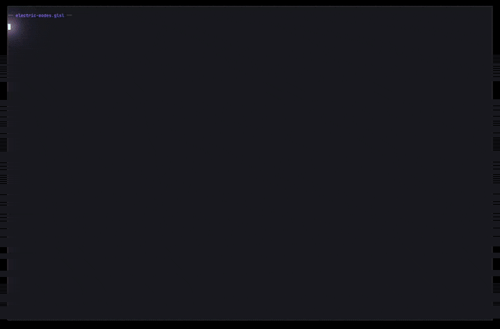

# ghostty-shader-adventures

Custom fragment shaders for [Ghostty](https://ghostty.org) terminal. Post-processing effects that run on every frame, transforming terminal output on the GPU.

All shaders use colors from the [Human++](https://github.com/fielding/human-plus-plus) palette — swap out the color constants to match your own theme.

## Shaders

### splatter

Fractal paint splatters, cursor paintbrush.


> See also [`splatter-original.glsl`](shaders/splatter-original.glsl) for a static non-interactive version.

### clouds

Parallax FBM clouds.


### hexglitch

Hex Moire interference + CRT glitch.


### electric

Typing-reactive electric arcs (set and enjoy).


### electric-modes

Three-mode electric arcs via cursor color.



### cursor-glitch

Cursor-localized digital interference. **Stackable** — layer on any base shader, zero cost when idle.

## Usage

In your Ghostty config:

```
custom-shader = /path/to/ghostty-shader-adventures/shaders/splatter.glsl
custom-shader-animation = true
```

Shaders can be stacked — each shader's output feeds into the next as `iChannel0`:

```
custom-shader = /path/to/shaders/hexglitch.glsl
custom-shader = /path/to/shaders/cursor-glitch.glsl
```

Cursor interactivity works in standard shell sessions and some TUI apps but not all (e.g. Claude Code uses alternate screen handling that doesn't update cursor uniforms).

## Reference

See [GHOSTTY_SHADERS.md](GHOSTTY_SHADERS.md) for the full shader authoring reference — available uniforms, coordinate system, stacking details, and Shadertoy porting notes.
